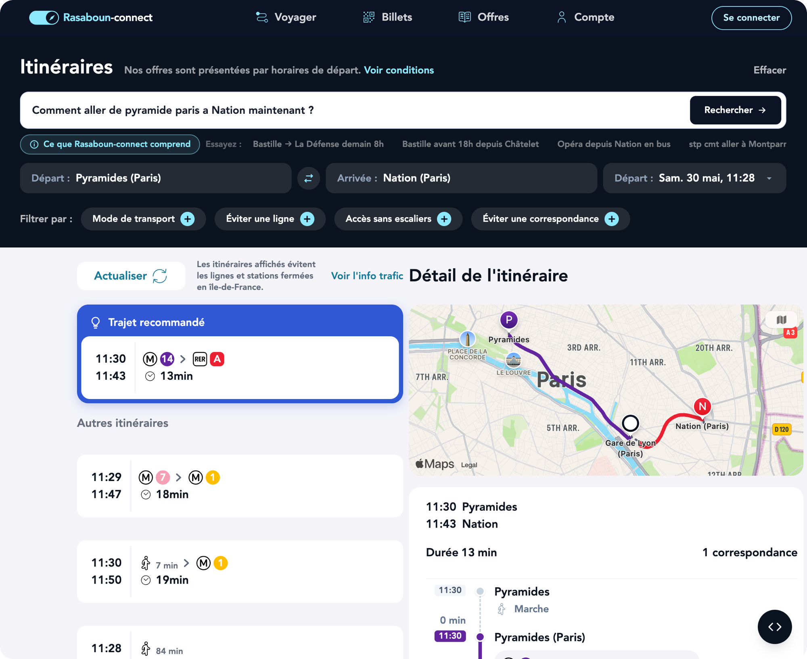

#  Rasaboun-Connect

**Ask for directions in plain French — get a full transit itinerary, without leaving your browser.**

Type your trip the way you'd say it out loud — *"Comment aller de Châtelet à Nation ?"* —
and Rasaboun-connect works out where you're going, when, and how, then lays the routes over
a live map. No forms, no *Départ / Arrivée* fields, no dropdowns. Just a sentence.

<p align="center">
  
</p>

The twist: **the language model runs on your device.** A small 26M-parameter model is
downloaded once and executed right in your browser (WebAssembly) — your phrasing is never
sent to a server to be understood. It picks up on times and modes too
(*"arriver à Bastille avant 18h"*, *"…en bus"*, *"prochains métros à Saint-Lazare"*) and
tells you politely when something's out of scope. Live routes and schedules for
Paris / Île-de-France come from a small proxy, and the journey is drawn on an Apple map
alongside a step-by-step timeline.

> Independent demo by Rasaboun, inspired by the SNCF Connect search experience.
> Not affiliated with SNCF or SNCF Connect.

## How it works

1. **Understand** — your sentence is parsed by **needle-transit**, a 26M-parameter
   encoder-decoder model, exported to ONNX and run in the browser via
   [`onnxruntime-web`](https://onnxruntime.ai/) (multi-threaded WASM). It emits a
   tool call — `search_itinerary` or `get_next_arrivals` — or refuses if the
   request is out of scope.
   - Model + training: https://github.com/rasaboun/needle-transit
   - ONNX weights: https://huggingface.co/rasaboun/needle-transit-onnx
2. **Fetch** — the tool call is resolved against the IDFM / Navitia API through a
   small proxy Worker (see [Architecture](#architecture)), so no API key ships in
   the browser.
3. **Show** — itineraries render as a timeline, with the full route drawn on an
   Apple MapKit JS map.

The model (~140 MB of ONNX weights) is downloaded once from the Hugging Face Hub,
then cached in IndexedDB — subsequent visits load instantly.

## Architecture

Two pieces:

- **Frontend** (this repo) — React + Vite + TypeScript SPA. Hosted as a static
  site on Cloudflare Workers static assets. Holds **no secrets**: it only needs
  the proxy URL (`VITE_NAVITIA_PROXY_URL`).
- **navitia-proxy** — a separate Hono Cloudflare Worker. Holds the IDFM/Navitia
  `apiKey` as a secret, serves the Apple MapKit JS token (`/mapkit-token`),
  rate-limits per IP, and is CORS-locked to the deploy origin. So neither the
  transit key nor the map token ever reach the bundle.

```
browser ──┬─ HF Hub            (ONNX model weights, cached in IndexedDB)
          ├─ jsDelivr          (onnxruntime-web WASM runtime)
          └─ navitia-proxy ──── IDFM / Navitia API   (apiKey injected server-side)
                          └──── MapKit JS token
```

## Stack

- **Vite** + **React 19** + **TypeScript**
- **onnxruntime-web** — runs `encoder.onnx` + `decoder_step.onnx` with a KV-cache
  decode loop in WASM
- **@sctg/sentencepiece-js** — SentencePiece tokenizer (WASM)
- **idb** — IndexedDB model cache
- **Apple MapKit JS** — itinerary map
- **Hono** — the navitia-proxy Worker

## Run

```bash
npm install
cp .env.example .env       # set VITE_NAVITIA_PROXY_URL to your proxy Worker URL
npm run dev                # http://localhost:5173
npm run build && npm run preview
npm test
```

Without `VITE_NAVITIA_PROXY_URL`, the app falls back to demo data (no live
itineraries, no map).

## Cross-origin isolation

Multi-threaded WASM needs `SharedArrayBuffer`, which requires:

```
Cross-Origin-Opener-Policy: same-origin
Cross-Origin-Embedder-Policy: credentialless
```

These are set in `vite.config.ts` (dev/preview) and `public/_headers` (production).
`credentialless` (not `require-corp`) keeps `SharedArrayBuffer` working on
Chromium/Firefox while letting Apple MapKit tiles load. Safari lacks
`credentialless`, so the map degrades gracefully there (hidden) while the rest of
the app works.

## Deploy

Static site on Cloudflare Workers assets (`wrangler.jsonc`):

```bash
npm run build
npx wrangler deploy
```

The ONNX runtime WASM is loaded from a CDN at runtime, so it is excluded from the
upload via `public/.assetsignore` (it also exceeds Cloudflare's 25 MiB per-file
asset limit).

## License

MIT — see [LICENSE](LICENSE). Cited brands and logos belong to their respective
owners.
